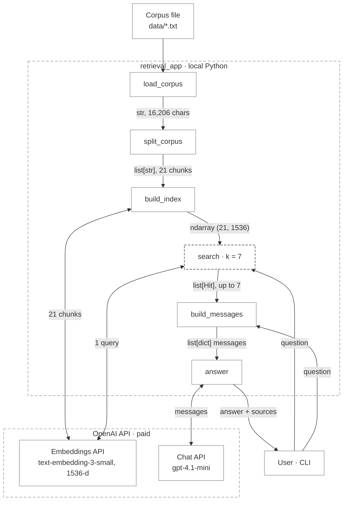

# Retrieval App: Pipeline

```mermaid
flowchart TB
    corpus["Corpus file<br/>data/*.txt"]
    user["User · CLI"]

    subgraph app["retrieval_app · local Python"]
        load["load_corpus"]
        split["split_corpus"]
        index["build_index"]
        search["search · k = 7"]
        msgs["build_messages"]
        ans["answer"]
        load -->|"str, 16,206 chars"| split
        split -->|"list[str], 21 chunks"| index
        index -->|"ndarray (21, 1536)"| search
        search -->|"list[Hit], up to 7"| msgs
        msgs -->|"list[dict] messages"| ans
    end

    subgraph openai["OpenAI API · paid"]
        emb["Embeddings API<br/>text-embedding-3-small, 1536-d"]
        chat["Chat API<br/>gpt-4.1-mini"]
    end

    corpus --> load
    user -->|question| search
    user -->|question| msgs
    ans -->|"answer + sources"| user

    index <-->|"21 chunks"| emb
    search <-->|"1 query"| emb
    ans <-->|messages| chat

    classDef default fill:transparent,stroke:#888,stroke-width:1px
    classDef step4 fill:transparent,stroke:#888,stroke-width:2px,stroke-dasharray:5 3
    class search step4
    style app fill:transparent,stroke:#888,stroke-dasharray:6 4
    style openai fill:transparent,stroke:#888,stroke-dasharray:6 4
```

Dashed box = Step 4 change (k = 3 → 7). Each question makes 3 paid calls: two to the Embeddings API and one to the Chat API.